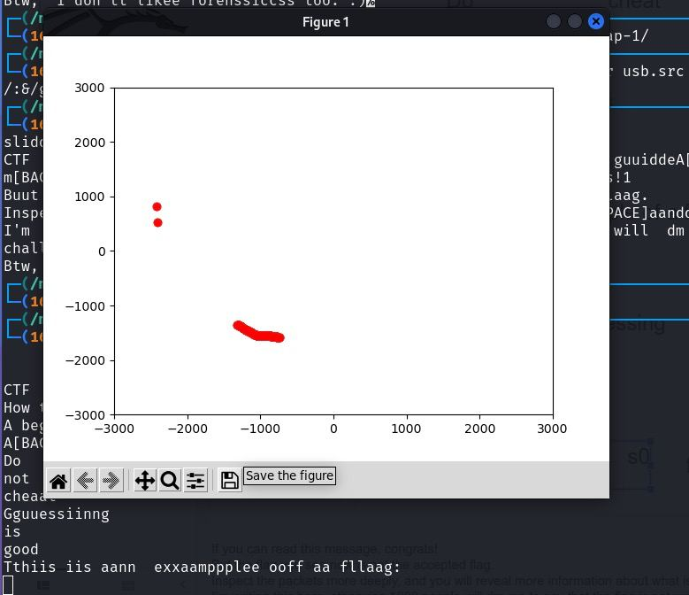
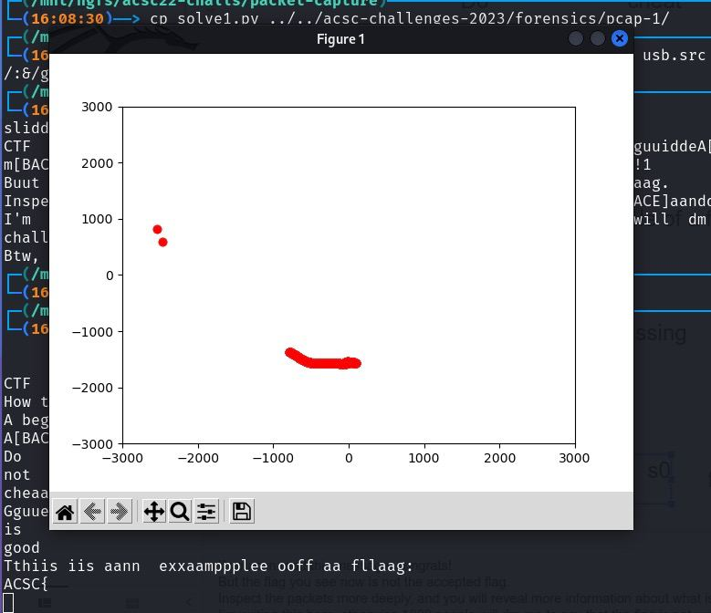
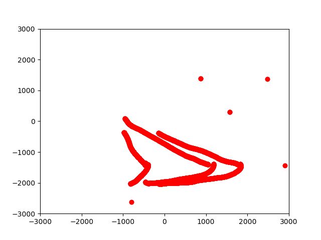

In the keystrokes extracted from part 1:

```
sliddeess.ggooglee.coom
CTF  Intttro PrresseentaatiionHow to be good aat CTFs?A beginneer's  guuiddeA[BACKSPACE]DonotcheaatGguuessiinngisgoodTthiis iis aann  exxaamppplee ooff aa fllaag:ACSC{f0r3ns1cs_is_s0_fum[BACKSPACE]n}If  yoouu ccaan  rreeeaad ttthiss mmessagge, conngraats!1
Buut  tthee flaagg yoou sseee nnow iiss nnoott  thhee acceepteeed fllaag.
Inspeect  tthhee ppaacckeettss mmmmrree ddeeply, ma[BACKSPACE][BACKSPACE]aandd yoouu wwill rrevveaal mmmrree iinfom[BACKSPACE]rrmaatiion  aaboouutt wwhhaatt iss hhaappeeniing.
I'm  wwrrittiinngg tthhhiss  herre, othheerrwisse 11000 peeooppllee  will  dm mmee tto ssay  tthaat  tthe flaagg is nnoott worrkiinng,, oooor [BACKSPACE][BACKSPACE][BACKSPACE]r  thhee cchallengge iiss broken.
Btw,  I don'tt likee forenssiccss too. :)
```

We can see that the user is preparing some presentation slides. [solve.py](./solve.py) will show the mouse clicks, followed by the user's keystrokes.
For example:

Image 1 - After user enters `This is an example of a flag:`, the user draws a textbox on the slide. This is shown on the plot, the mouse click dragged from top left to bottom right of the textbox.



Image 2 - After user draws the textbox (shown in Image 1), the user enters `ACSC{`. And the plot shows the next textbox drawn.



In both images above, there are 2 dots on the left side of the plot. This is the user clicking `Insert`->`Text box` in the menu of Google Slides.

Of course, it is not reasonable to expect that the player should identify a text box from 2 clicks. But there should be sufficient hints to lead to the inference that the user is creating text boxes.

1. The user is creating presentation slides (text boxes are common).
2. A lot of mouse click dragging from top left to bottom right, and keystrokes immediately follow it.
3. There are no spaces in 2 of the sentences.
    - i.e. no spaces and no newlines in `DonotcheatGuessingisgood`

After the flag from part 1 is written `ACSC{f0r3ns1cs_is_s0_fun}`, there are some more mouse click drags.



If one pays close attention, 3 words (`f0r3ns1cs`, `s0`, `fun`) from the flag are dragged away to the bottom of the slide (dragging to the left and down). Then 3 words (`Guessing`, `not`, `good`) written earlier (above the flag) are dragged into the flag (dragging to the right and down).

So in the end, the flag is `ACSC{Guessing_is_not_good}`.